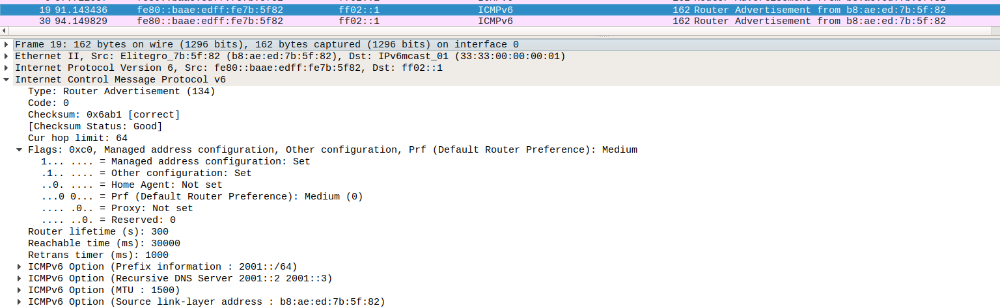

---
LINUX IPV6
---

# LINUX IPV6

## 目录

[-------------------------------IPV6 地址格式------------------------------------ ](#ipv6addressformat)

[--------------------------------SLAAC------------------------------------------- ](#SLAAC)

[-------------------------目前项目中具体使用的软件----------------------------------](#nowapps)

-------

## IPV6地址格式

### <span id="ipv6addressformat"></span>

IPv6地址由被划分为8个16位块的128位组成。 然后将每个块转换为由冒号符号分隔的4位十六进制数字。

    2001:0000:3238:00E1:0063:0000:0000:FEFB

每一块多个前导的0可以省略，一个块全为0可以简写为一个0，,多个块为连续0的话可以简写为:: 但是多个块的省略只能使用一次。

    2001:0:3238:E1:0063::FEFB

URL中ipv6如要使用地址必须加[]

    http://[2001:0:3238:E1:0063::FEFB]:80


详细可见 <RFC 2460>

**地址结构：**

```c
struct in6_addr {
    union {
        __u8        u6_addr8[16];
#if __UAPI_DEF_IN6_ADDR_ALT
        __be16        u6_addr16[8];
        __be32        u6_addr32[4];
#endif
    } in6_u;
```

## IPv6 地址的生成方式

### Link-Local Address

除手动配置外，一般在某一 interface enable ipv6 时，该 interface 会根据响应的算法，会在内核中生成一个 fe80 开头的本地链路地址。具体代码位置如下：

```c
/*
 * linux-3.4.11\net\ipv6\addrconf.c
*/
int __init addrconf_init(void)
{
        ...
    register_netdevice_notifier(&ipv6_dev_notf);
        ...
}

/*
 *	addrconf module should be notified of a device going up
 */
static struct notifier_block ipv6_dev_notf = {
	.notifier_call = addrconf_notify,
};

static int addrconf_notify(struct notifier_block *this, unsigned long event,
			   void * data)
{
	struct net_device *dev = (struct net_device *) data;
	struct inet6_dev *idev = __in6_dev_get(dev);
	int run_pending = 0;
	int err;

	switch (event) {
	    ....
	case NETDEV_UP:
	case NETDEV_CHANGE:
        ....
        default:
			addrconf_dev_config(dev);
    ....
}

static void addrconf_dev_config(struct net_device *dev)
{
	struct in6_addr addr;
	struct inet6_dev    * idev;

	ASSERT_RTNL();

	if ((dev->type != ARPHRD_ETHER) &&
	    (dev->type != ARPHRD_FDDI) &&
	    (dev->type != ARPHRD_IEEE802_TR) &&
	    (dev->type != ARPHRD_ARCNET) &&
	    (dev->type != ARPHRD_INFINIBAND)) {
		/* Alas, we support only Ethernet autoconfiguration. */
		return;
	}

	idev = addrconf_add_dev(dev);
	if (IS_ERR(idev))
		return;

	memset(&addr, 0, sizeof(struct in6_addr));
	addr.s6_addr32[0] = htonl(0xFE800000);

	if (ipv6_generate_eui64(addr.s6_addr + 8, dev) == 0)
		addrconf_add_linklocal(idev, &addr);
}

```

### Global Address

除手动状态外，自动配置还可以根据路由通告(RA - Router Advertise)的内布信息分为两种。

**无状态(stateless):** 
    在这种模式下，RA Flag 中 M-Flag & O-Flag 都为 0. 这时，IPv6 地址以及其他信息，完全不依赖于 DHCPv6 。Global IP 通过 RA 报文中提供的子网前缀信息(prefix information)，通过相关算法得到自己的 Global IP 。其他信息，比如 DNS 服务器信息，也可以从 RA 中获得。

**有状态(state):**
    有状态仍然可分为两种情况。
    一是 Stateful DHCPv6 --->  M-Flag=1 O-Flag=1, 在这种情况下 Global Ip 以及其他信息都是通过 DHCPv6 server 提供。
    二是 Stateless DHCPv6 --> M-Flag=0 O-Flag=1, 在这种情况下 Global IP 还是通过 RA prefix information 计算得到，其他信息通过 DHCPv6 server 得到。



## SLAAC

### <span id="SLAAC"></span>

SLAAC(Stateless address autoconfiguration) 无状态地址的自动配置。在这种情况下主机不依靠DHCPv6而只依靠RA信息对IPv6地址进行配置。

## IPV6 在内核中的初始化方式

## 当前使用的软件

下发 RA 信息         RADVD        配置方式

 接受DHCP信息     DHCP6c      配置方式

下发DHCP信息     DHCP6s

 接受 RA 信息        linux kernel