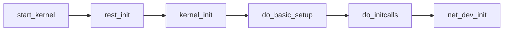
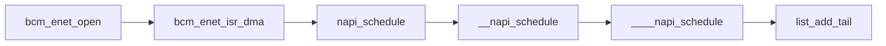

# Linux-net-stack

## 重要的结构

net_device & sk_buff , 这两个结构分别抽象了网络设备 和 网络数据包。是两个特别大的数据结构，分别位于 include\linux\netdevice.h 和 include\linux\skbuff.h 中。

## 初始化过程

### 网卡初始化

从开机一直到初始化网络设备的过程。



然后看 net_dev_init 这个函数。初始化了 ptype_all 和 ptype_base 两个链表 [作用](#allandbase)。
这里为每一个CPU初始化了一个softnet_data数据结构。在后面的过程中会把网卡的各种信息挂到这个数据上，这样在发生中断时就可以立刻调用[per-cpu介绍文章](http://www.deansys.com/doc/ldd3/ch08s04.html)。开启了网络 TX & RX 的软中断，这样网卡在注册到中断上之后，内核就可以根据网卡的行为做出响应。


### <span id="init_ptype_all"></span>

```c
static int __init net_dev_init(void)
{
    int i, rc = -ENOMEM;
    ....
    INIT_LIST_HEAD(&ptype_all);
    for (i = 0; i < PTYPE_HASH_SIZE; i++)
        INIT_LIST_HEAD(&ptype_base[i]);

    if (register_pernet_subsys(&netdev_net_ops))
        goto out;

    for_each_possible_cpu(i) {
        struct softnet_data *sd = &per_cpu(softnet_data, i);

        memset(sd, 0, sizeof(*sd));
        skb_queue_head_init(&sd->input_pkt_queue);
        skb_queue_head_init(&sd->process_queue);
        sd->completion_queue = NULL;
        INIT_LIST_HEAD(&sd->poll_list);
        sd->output_queue = NULL;
        sd->output_queue_tailp = &sd->output_queue;
#ifdef CONFIG_RPS
        sd->csd.func = rps_trigger_softirq;
        sd->csd.info = sd;
        sd->csd.flags = 0;
        sd->cpu = i;
#endif

        sd->backlog.poll = process_backlog;
        sd->backlog.weight = weight_p;
        sd->backlog.gro_list = NULL;
        sd->backlog.gro_count = 0;
    }

    dev_boot_phase = 0;

    if (register_pernet_device(&loopback_net_ops))
        goto out;

    if (register_pernet_device(&default_device_ops))
        goto out;

    open_softirq(NET_TX_SOFTIRQ, net_tx_action);
    open_softirq(NET_RX_SOFTIRQ, net_rx_action);

    hotcpu_notifier(dev_cpu_callback, 0);
    dst_init();
    dev_mcast_init();
    rc = 0;
out:
    return rc;
}
```

接下来看 net_rx_action 函数，看看内核收到网卡的产生的读中断会干什么？
在这个函数中，会取出 per-cpu 变量 softnet_data 调用 其中 poll_list 中成员的 poll 函数。
而这个函数就会是最终调用 netif_receive_skb 的地方。

```c
static void net_rx_action(struct softirq_action *h)
{
    struct softnet_data *sd = &__get_cpu_var(softnet_data);
        ....
    while (!list_empty(&sd->poll_list)) {
        struct napi_struct *n;
        int work, weight;

            ....

        n = list_first_entry(&sd->poll_list, struct napi_struct, poll_list);

        work = 0;
        if (test_bit(NAPI_STATE_SCHED, &n->state)) {
            work = n->poll(n, weight);
            trace_napi_poll(n);
        }
            ....
}
```

## 实际分析

下面看一个网卡驱动的实际例子。代码位于3.4.11版本内核的 driver/net/ethernet/broadcom/bcm63xx_enet.c中。

首先 `module_init(bcm_enet_init);`对网卡初始化函数向内核进行注册。bcm_enet_init 会根据不同的情况初始化不同的网卡驱动。
而在 bcm63xx_enet_driver 结构中，赋值了 probe 。这个函数的作用就是使得内核可以探测到网卡的一系列驱动行为。网卡驱动的很大一部分操作都是在这个函数中完成的。

```c
struct platform_driver bcm63xx_enet_driver = {
    .probe    = bcm_enet_probe,
    .remove    = __devexit_p(bcm_enet_remove),
    .driver    = {
        .name    = "bcm63xx_enet",
        .owner  = THIS_MODULE,
    },
};
```

在其中注册了网络设备的结构 bcm_enet_ops 以及 一些网络工具 bcm_enet_ethtool_ops。

```c
static int __devinit bcm_enet_probe(struct platform_device *pdev)
{
    struct bcm_enet_priv *priv;
    struct net_device *dev;
    struct bcm63xx_enet_platform_data *pd;
    struct resource *res_mem, *res_irq, *res_irq_rx, *res_irq_tx;
    struct mii_bus *bus;
    const char *clk_name;
    unsigned int iomem_size;
    int i, ret;

    /* stop if shared driver failed, assume driver->probe will be
     * called in the same order we register devices (correct ?) */
    if (!bcm_enet_shared_base)
        return -ENODEV;

    res_mem = platform_get_resource(pdev, IORESOURCE_MEM, 0);
    res_irq = platform_get_resource(pdev, IORESOURCE_IRQ, 0);
    res_irq_rx = platform_get_resource(pdev, IORESOURCE_IRQ, 1);
    res_irq_tx = platform_get_resource(pdev, IORESOURCE_IRQ, 2);
    if (!res_mem || !res_irq || !res_irq_rx || !res_irq_tx)
        return -ENODEV;

    ret = 0;
    dev = alloc_etherdev(sizeof(*priv));    //初始化 net_device 结构
    if (!dev)
        return -ENOMEM;
    priv = netdev_priv(dev);

    ret = compute_hw_mtu(priv, dev->mtu);
    if (ret)
        goto out;

    iomem_size = resource_size(res_mem);
    if (!request_mem_region(res_mem->start, iomem_size, "bcm63xx_enet")) {
        ret = -EBUSY;
        goto out;
    }

    priv->base = ioremap(res_mem->start, iomem_size);
    if (priv->base == NULL) {
        ret = -ENOMEM;
        goto out_release_mem;
    }
    dev->irq = priv->irq = res_irq->start;
    priv->irq_rx = res_irq_rx->start;
    priv->irq_tx = res_irq_tx->start;
    priv->mac_id = pdev->id;
        .....
    /* register netdevice */
    dev->netdev_ops = &bcm_enet_ops;
    netif_napi_add(dev, &priv->napi, bcm_enet_poll, 16);        // 注册 poll 函数

    SET_ETHTOOL_OPS(dev, &bcm_enet_ethtool_ops);
    SET_NETDEV_DEV(dev, &pdev->dev);

    ret = register_netdev(dev);
    if (ret)
        goto out_unregister_mdio;

    netif_carrier_off(dev);
    platform_set_drvdata(pdev, dev);
    priv->pdev = pdev;
    priv->net_dev = dev;

    return 0;
    ....
}

static const struct net_device_ops bcm_enet_ops = {
    .ndo_open        = bcm_enet_open,
    .ndo_stop        = bcm_enet_stop,
    .ndo_start_xmit        = bcm_enet_start_xmit,
    .ndo_set_mac_address    = bcm_enet_set_mac_address,
    .ndo_set_rx_mode    = bcm_enet_set_multicast_list,
    .ndo_do_ioctl        = bcm_enet_ioctl,
    .ndo_change_mtu        = bcm_enet_change_mtu,
#ifdef CONFIG_NET_POLL_CONTROLLER
    .ndo_poll_controller = bcm_enet_netpoll,
#endif
};
```

在 bcm_enet_open 中 注册中断函数 bcm_enet_isr_dma 。



```c
/*
 * rx/tx dma interrupt handler
 */
static irqreturn_t bcm_enet_isr_dma(int irq, void *dev_id)
{
    struct net_device *dev;
    struct bcm_enet_priv *priv;

    dev = dev_id;
    priv = netdev_priv(dev);

    /* mask rx/tx interrupts */
    enet_dma_writel(priv, 0, ENETDMA_IRMASK_REG(priv->rx_chan));
    enet_dma_writel(priv, 0, ENETDMA_IRMASK_REG(priv->tx_chan));

    napi_schedule(&priv->napi);

    return IRQ_HANDLED;
}

static inline void napi_schedule(struct napi_struct *n)
{
	if (napi_schedule_prep(n))
		__napi_schedule(n);
}

void __napi_schedule(struct napi_struct *n)
{
	unsigned long flags;

	local_irq_save(flags);
	____napi_schedule(&__get_cpu_var(softnet_data), n);
	local_irq_restore(flags);
}

/* Called with irq disabled */
static inline void ____napi_schedule(struct softnet_data *sd,
				     struct napi_struct *napi)
{
	list_add_tail(&napi->poll_list, &sd->poll_list);
	__raise_softirq_irqoff(NET_RX_SOFTIRQ);
}
```

其实bcm_enet_isr_dma函数之后的napi_schedule函数已经是属于 kernel API 了。如果是自己写驱动基本也就到这里就结束了。。。

深究一下，到这里就和前面的 net_dev_init 中注册的中断函数 net_rx_action 呼应上了。既然会调用 网络设备的 poll 函数...
在  bcm_enet_probe 函数中找到 netif_napi_add(dev, &priv->napi, bcm_enet_poll, 16);
**bcm_enet_poll** 这个就是网络设备的 poll 函数了。
在其中找到 rx_work_done = bcm_enet_receive_queue(dev, budget); 
发现了这个 netif_receive_skb(skb); 这个函数就是将 数据包交给 上层协议栈处理的。
接着看进去。。。。。 调用了 __netif_receive_skb 函数。

这个函数中最关键的就是 `pt_prev->func(skb, skb->dev, pt_prev, orig_dev);` 这一行。

This function is also encapsulated in deliver_skb. Now we want to know what function will this 'func' call. Let's check the definition of pt_prev.

**In function __netif_receive_skb:**
挺坑人的，里面if没有括号，看了好几次才找到这里。。。。
```c
list_for_each_entry_rcu(ptype, &ptype_all, list) {
        if (!ptype->dev || ptype->dev == skb->dev) {
            if (pt_prev)
                ret = deliver_skb(skb, pt_prev, orig_dev);
            pt_prev = ptype;
        }
    }
```

The value ptype is a member of the list structure named ptype_all. **What is the ptype_all ?**
The ptype_all is initialized when the network device is initialized. [Do you remember?](#init_ptype_all)
Where is the ptype_all structure filled ?

In the IPv4 protocol initialization (linux-3.4.11\net\ipv4\af_inet.c):

```c
static int __init inet_init(void)
{
    struct sk_buff *dummy_skb;
    struct inet_protosw *q;
    struct list_head *r;
    int rc = -EINVAL;

    BUILD_BUG_ON(sizeof(struct inet_skb_parm) > sizeof(dummy_skb->cb));

    sysctl_local_reserved_ports = kzalloc(65536 / 8, GFP_KERNEL);
    if (!sysctl_local_reserved_ports)
        goto out;

    rc = proto_register(&tcp_prot, 1);
    if (rc)
        goto out_free_reserved_ports;

    rc = proto_register(&udp_prot, 1);
    if (rc)
        goto out_unregister_tcp_proto;

    rc = proto_register(&raw_prot, 1);
    if (rc)
        goto out_unregister_udp_proto;

    rc = proto_register(&ping_prot, 1);
    if (rc)
        goto out_unregister_raw_proto;
```

注册 struct proto ，将其加入到 port_list 中

注册创建 inet socket 时需要的函数

```c
    (void)sock_register(&inet_family_ops);

    static const struct net_proto_family inet_family_ops = {
    .family = PF_INET,
    .create = inet_create,
    .owner    = THIS_MODULE,
};
```

注册协议（先往后看，不深究）。

```c
    /*
     *    Add all the base protocols.
     */

    if (inet_add_protocol(&icmp_protocol, IPPROTO_ICMP) < 0)
        pr_crit("%s: Cannot add ICMP protocol\n", __func__);
    if (inet_add_protocol(&udp_protocol, IPPROTO_UDP) < 0)
        pr_crit("%s: Cannot add UDP protocol\n", __func__);
    if (inet_add_protocol(&tcp_protocol, IPPROTO_TCP) < 0)
        pr_crit("%s: Cannot add TCP protocol\n", __func__);
#ifdef CONFIG_IP_MULTICAST
    if (inet_add_protocol(&igmp_protocol, IPPROTO_IGMP) < 0)
        pr_crit("%s: Cannot add IGMP protocol\n", __func__);
#endif
```

注册 inetsw 每一个成员都是一个链表。 而 inetsw_array 的成员在初始化的时候就包含了协议的相关操作。下面有代码.
在使用 inet_register_protosw 函数对 inetsw_array 的成员注册的时候。会将 inetsw 对应成员的指针存入 last_perm 变量。
再通过 `list_add_rcu(&p->list, last_perm);` 将指针存入到 inet_protosw 的 list 成员中，这样， inetsw 和 inetsw_array 就建立了联系。

```c
    /* Register the socket-side information for inet_create. */
    for (r = &inetsw[0]; r < &inetsw[SOCK_MAX]; ++r)
        INIT_LIST_HEAD(r);

    for (q = inetsw_array; q < &inetsw_array[INETSW_ARRAY_LEN]; ++q)
        inet_register_protosw(q);


void inet_register_protosw(struct inet_protosw *p)
{
    struct list_head *lh;
    struct inet_protosw *answer;
    int protocol = p->protocol;
    struct list_head *last_perm;

    spin_lock_bh(&inetsw_lock);

    if (p->type >= SOCK_MAX)
        goto out_illegal;

    /* If we are trying to override a permanent protocol, bail. */
    answer = NULL;
    last_perm = &inetsw[p->type];
    list_for_each(lh, &inetsw[p->type]) {
        answer = list_entry(lh, struct inet_protosw, list);

        /* Check only the non-wild match. */
        if (INET_PROTOSW_PERMANENT & answer->flags) {
            if (protocol == answer->protocol)
                break;
            last_perm = lh;
        }

        answer = NULL;
    }
    if (answer)
        goto out_permanent;

    /* Add the new entry after the last permanent entry if any, so that
     * the new entry does not override a permanent entry when matched with
     * a wild-card protocol. But it is allowed to override any existing
     * non-permanent entry.  This means that when we remove this entry, the
     * system automatically returns to the old behavior.
     */
    list_add_rcu(&p->list, last_perm);
        ......

}


static struct inet_protosw inetsw_array[] =
{
    {
        .type =       SOCK_STREAM,
        .protocol =   IPPROTO_TCP,
        .prot =       &tcp_prot,
        .ops =        &inet_stream_ops,
        .no_check =   0,
        .flags =      INET_PROTOSW_PERMANENT |
                  INET_PROTOSW_ICSK,
    },

    {
        .type =       SOCK_DGRAM,
        .protocol =   IPPROTO_UDP,
        .prot =       &udp_prot,
        .ops =        &inet_dgram_ops,
        .no_check =   UDP_CSUM_DEFAULT,
        .flags =      INET_PROTOSW_PERMANENT,
       },

       {
        .type =       SOCK_DGRAM,
        .protocol =   IPPROTO_ICMP,
        .prot =       &ping_prot,
        .ops =        &inet_dgram_ops,
        .no_check =   UDP_CSUM_DEFAULT,
        .flags =      INET_PROTOSW_REUSE,
       },

       {
           .type =       SOCK_RAW,
           .protocol =   IPPROTO_IP,    /* wild card */
           .prot =       &raw_prot,
           .ops =        &inet_sockraw_ops,
           .no_check =   UDP_CSUM_DEFAULT,
           .flags =      INET_PROTOSW_REUSE,
       }
};
```

省略一部分代码。 通过一下代码可以看出，内核将按照包的类型将其连接入 ptype_all 和 ptype_base 的链表中去。
在 __netif_receive_skb 函数中，不正是靠着 skb->protocol 和 ptype_all ptype_base 中的成员做协议匹配的么。

```c
    dev_add_pack(&ip_packet_type);

    static struct packet_type ip_packet_type __read_mostly = {
        .type = cpu_to_be16(ETH_P_IP),
        .func = ip_rcv,
        .gso_send_check = inet_gso_send_check,
        .gso_segment = inet_gso_segment,
        .gro_receive = inet_gro_receive,
        .gro_complete = inet_gro_complete,
    };

    void dev_add_pack(struct packet_type *pt)
    {
        struct list_head *head = ptype_head(pt);

        spin_lock(&ptype_lock);
        list_add_rcu(&pt->list, head);
        spin_unlock(&ptype_lock);
    }

    static inline struct list_head *ptype_head(const struct packet_type *pt)
    {
        if (pt->type == htons(ETH_P_ALL))
            return &ptype_all;
        else
            return &ptype_base[ntohs(pt->type) & PTYPE_HASH_MASK];
    }
```


## 几个重要数据

### <span id="allandbase"></span>

poll_list  port_list  ptype_all  ptype_base 以及 packet_type 的 list成员。

### poll_list

`subsys_initcall(net_dev_init);` poll_list 声明在网络子系统的初始化中。该结构是为了调用网络设备的 poll 函数所准备的。上面已经有基本比较详细的介绍。

### proto_list

proto_list 就是上面 proto_register 函数中将 struct proto 连接到的表。该结构初始化在 `D:\studycode\linux-3.4.11\net\core\sock.c` 中。
`static LIST_HEAD(proto_list);` 其是一个静态的链表。

倒着可以追到以下的调用关系
`subsys_initcall(proto_init)` --> `register_pernet_subsys(&proto_net_ops)` --> `proto_init_net` --> `proc_net_fops_create` --> `seq_open_net` 
--> `proto_seq_start` --> `seq_list_start_head` 

在从头看过来 
`register_pernet_subsys` --> `register_pernet_operations` --> `__register_pernet_operations` --> `ops_init` --> `proto_init_net`
--> `proc_net_fops_create` --> `proc_create`
可看出，这一轮操作是为了将包含 proto_list 的结构注册到 proc 中。（关于 proc 先 mark 一下）。

### packet_type 与 ptype_all ptype_base

该结构会被根据类型被添加到 ptype_all 或者 ptype_base 中。在 __netif_receive_skb 会根据协议调用其对应的 func 函数，处理网络数据包。

## 时间线

整理一下内核调用这些code 的时间线。首先是一些声明

subsys_initcall(net_dev_init)    // 初始化网络设备
subsys_initcall(proto_init)        // 初始化网络协议栈
fs_initcall(inet_init);            // 初始化网络

inet_init 初始化了各种协议处理操作，用户结构等。并初始化 IP 层函数。
proto_init 将 proto_list 以及一些其他信息注册到 proc 文件系统
net_dev_init 初始化网络设备，使得网络设备的驱动与linux 产生联系

各种 init 的声明都在 `include\linux\init.h` 中。

```c
#define pure_initcall(fn)        __define_initcall("0",fn,0)

#define core_initcall(fn)        __define_initcall("1",fn,1)
#define core_initcall_sync(fn)        __define_initcall("1s",fn,1s)
#define postcore_initcall(fn)        __define_initcall("2",fn,2)
#define postcore_initcall_sync(fn)    __define_initcall("2s",fn,2s)
#define arch_initcall(fn)        __define_initcall("3",fn,3)
#define arch_initcall_sync(fn)        __define_initcall("3s",fn,3s)
#define subsys_initcall(fn)        __define_initcall("4",fn,4)
#define subsys_initcall_sync(fn)    __define_initcall("4s",fn,4s)
#define fs_initcall(fn)            __define_initcall("5",fn,5)
#define fs_initcall_sync(fn)        __define_initcall("5s",fn,5s)
#define rootfs_initcall(fn)        __define_initcall("rootfs",fn,rootfs)
#define device_initcall(fn)        __define_initcall("6",fn,6)
#define device_initcall_sync(fn)    __define_initcall("6s",fn,6s)
#define late_initcall(fn)        __define_initcall("7",fn,7)
#define late_initcall_sync(fn)        __define_initcall("7s",fn,7s)
```

__define_initcall 声明：

```c
#define __define_initcall(level,fn,id) \
    static initcall_t __initcall_##fn##id __used \
    __attribute__((__section__(".initcall" level ".init"))) = fn
```

attribute 是更改函数属性的意思。比如 `fs_initcall(inet_init)` 就是要把 inet_init 换成 `__initcall_inet_init5` 并将这个函数的段属性设置为 `.initcall5.init`。

在内核初始化时会有以下代码,可以看出这些初始化函数是按照 level 的级别来进行初始化的。其实看 init.h 中初始化宏的名字，根据重要性也能大致得出这个结论。

```c
static void __init do_initcalls(void)
{
    int level;

    for (level = 0; level < ARRAY_SIZE(initcall_levels) - 1; level++)
        do_initcall_level(level);
}
```

## 书接上文

目前已经知道的是 dev_add_pack() 这个函数的作用就是向内核链表就是那个 type_all 加入协议。搜索其引用也可以看出有很多的
这个这个中加入的协议。


在ipv4的初始化代码中就调用了 dev_add_pack(&ip_packet_type); 而这个函数的 func 成员则正是 下面的 ip_recv 函数。

```c
/*
 *     Main IP Receive routine.
 */
int ip_rcv(struct sk_buff *skb, struct net_device *dev, struct packet_type *pt, struct net_device *orig_dev)
{
    const struct iphdr *iph;
    u32 len;

    ..... // 对包进行检查的步骤进行了省略

    return NF_HOOK(NFPROTO_IPV4, NF_INET_PRE_ROUTING, skb, dev, NULL,
               ip_rcv_finish);

    ......
}
```

>    passing in the point where the call comes from (for instance, packet
>    reception) and the function to execute if the filtering rules configured by the user with the iptables command
>    do not decide to drop or reject the packet. If there are no rules to apply or they simply indicate "go ahead," the
>    function do_something_finish is executed.                  --------------- << Understanding Linux Network Internals >>

这个 NF_HOOK 宏又对应着 linux 中又一个重要的机制 netfiler 。以后再说！ 反正就是继续调用了 ip_rcv_finish.


ip_rcv_finish --> ip_route_input_noref --> ...... [LINUX路由子系统] ......--> ip_local_deliver --> ip_local_deliver_finish


```c

static int ip_local_deliver_finish(struct sk_buff *skb)
{
	struct net *net = dev_net(skb->dev);

	__skb_pull(skb, ip_hdrlen(skb));

	/* Point into the IP datagram, just past the header. */
	skb_reset_transport_header(skb);

	rcu_read_lock();
	{
		int protocol = ip_hdr(skb)->protocol;
		int hash, raw;
		const struct net_protocol *ipprot;

	resubmit:
		raw = raw_local_deliver(skb, protocol);

		hash = protocol & (MAX_INET_PROTOS - 1);
		ipprot = rcu_dereference(inet_protos[hash]);
		if (ipprot != NULL) {
			int ret;
                ....
			ret = ipprot->handler(skb);
			if (ret < 0) {
				protocol = -ret;
				goto resubmit;
			}
			IP_INC_STATS_BH(net, IPSTATS_MIB_INDELIVERS);
		} else {
			if (!raw) {
				if (xfrm4_policy_check(NULL, XFRM_POLICY_IN, skb)) {
					IP_INC_STATS_BH(net, IPSTATS_MIB_INUNKNOWNPROTOS);
					icmp_send(skb, ICMP_DEST_UNREACH,
						  ICMP_PROT_UNREACH, 0);
				}
			} else
				IP_INC_STATS_BH(net, IPSTATS_MIB_INDELIVERS);
			kfree_skb(skb);
		}
	}
        ....
	return 0;
}
```

这里是 ip_local_deliver_finish 函数的大部分代码。可以明显的看出 比较关键的步骤就是 ipprot->handler(skb); 而这个 ipprot 
正是来自名字叫做 inet_protos 的哈希表，这个结构也是内核协议栈中很关键的一个连接步骤。（还能发送 ICMP 信息呢~）
还记不记得上文中的代码?

```c
if (inet_add_protocol(&icmp_protocol, IPPROTO_ICMP) < 0)
    pr_crit("%s: Cannot add ICMP protocol\n", __func__);
if (inet_add_protocol(&udp_protocol, IPPROTO_UDP) < 0)
    .....
```

这个 inet_add_protocol 函数就是将协议注册到 inet_protos 结构中的。

```c
int inet_add_protocol(const struct net_protocol *prot, unsigned char protocol)
{
	int hash = protocol & (MAX_INET_PROTOS - 1);

	return !cmpxchg((const struct net_protocol **)&inet_protos[hash],
			NULL, prot) ? 0 : -1;
}
```

通过查看这个函数的引用……可以看到，大量的协议被在这里注册。但是感觉这里 linux 中对协议的层次划分的没有很严格……
没有分析 linux 网络栈的协议细节，以后再说。。。。


