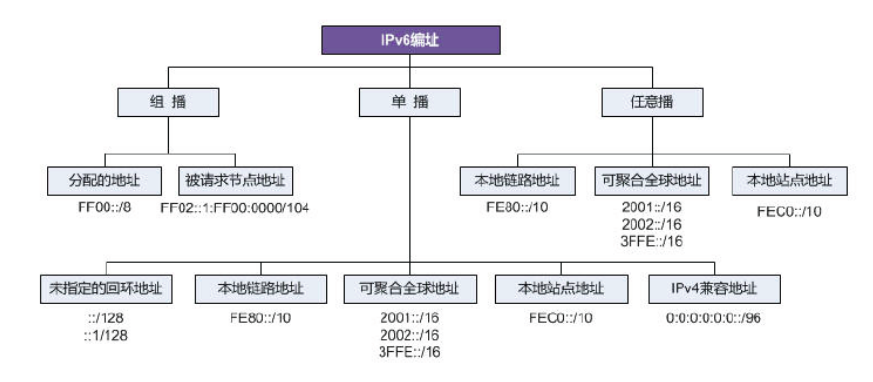

## IPV6地址格式

### <span id="ipv6addressformat"></span>

IPv6地址由被划分为8个16位块的128位组成。 然后将每个块转换为由冒号符号分隔的4位十六进制数字。

    2001:0000:3238:00E1:0063:0000:0000:FEFB

每一块多个前导的0可以省略，一个块全为0可以简写为一个0，,多个块为连续0的话可以简写为:: 但是多个块的省略只能使用一次。

    2001:0:3238:E1:0063::FEFB

URL中ipv6如要使用地址必须加[]

    http://[2001:0:3238:E1:0063::FEFB]:80



详细可见 <RFC 2460>

**地址结构：**

```c
struct in6_addr {
    union {
        __u8        u6_addr8[16];
#if __UAPI_DEF_IN6_ADDR_ALT
        __be16        u6_addr16[8];
        __be32        u6_addr32[4];
#endif
    } in6_u;
```

## IPv6 地址的生成方式

### Link-Local Address


除手动配置外，一般在某一 interface enable ipv6 时，该 interface 会根据响应，会在内核中生成一个 fe80 开头的本地链路地址。具体代码位置如下：

```c
/*
 * linux-3.4.11\net\ipv6\addrconf.c
*/
int __init addrconf_init(void)
{
        ...
    register_netdevice_notifier(&ipv6_dev_notf);
        ...
}

static struct notifier_block ipv6_dev_notf = {
	.notifier_call = addrconf_notify,
};

static int addrconf_notify(struct notifier_block *this, unsigned long event,
			   void * data)
{
	struct net_device *dev = (struct net_device *) data;
	struct inet6_dev *idev = __in6_dev_get(dev);
	int run_pending = 0;
	int err;

	switch (event) {
	    ....
	case NETDEV_UP:
	case NETDEV_CHANGE:
        ....
        default:
			addrconf_dev_config(dev);
    ....
}

static void addrconf_dev_config(struct net_device *dev)
{
	struct in6_addr addr;
	struct inet6_dev    * idev;

	ASSERT_RTNL();

	if ((dev->type != ARPHRD_ETHER) &&
	    (dev->type != ARPHRD_FDDI) &&
	    (dev->type != ARPHRD_IEEE802_TR) &&
	    (dev->type != ARPHRD_ARCNET) &&
	    (dev->type != ARPHRD_INFINIBAND)) {
		/* Alas, we support only Ethernet autoconfiguration. */
		return;
	}

	idev = addrconf_add_dev(dev);
	if (IS_ERR(idev))
		return;

	memset(&addr, 0, sizeof(struct in6_addr));
	addr.s6_addr32[0] = htonl(0xFE800000);

	if (ipv6_generate_eui64(addr.s6_addr + 8, dev) == 0)
		addrconf_add_linklocal(idev, &addr);
}

```

## Send RS

If the device starts, it will be send RS data packet.

Still in "addrconf_notify" function. 

```c
static void addrconf_dad_run(struct inet6_dev *idev)
{
	struct inet6_ifaddr *ifp;

	read_lock_bh(&idev->lock);
	list_for_each_entry(ifp, &idev->addr_list, if_list) {
		spin_lock(&ifp->lock);
		if (ifp->flags & IFA_F_TENTATIVE &&
		    ifp->state == INET6_IFADDR_STATE_DAD)
			addrconf_dad_kick(ifp);
		spin_unlock(&ifp->lock);
	}
	read_unlock_bh(&idev->lock);
}

static void addrconf_dad_kick(struct inet6_ifaddr *ifp)
{
	unsigned long rand_num;
	struct inet6_dev *idev = ifp->idev;

	if (ifp->flags & IFA_F_OPTIMISTIC)
		rand_num = 0;
	else
		rand_num = net_random() % (idev->cnf.rtr_solicit_delay ? : 1);

	ifp->probes = idev->cnf.dad_transmits;
	addrconf_mod_timer(ifp, AC_DAD, rand_num);
}


addrconf_mod_timer -> addrconf_dad_timer -> ndisc_send_ns

```
Therefore, If you reset the interface and the interface will send the RS packet.

## TODO
1. How to send RS packet
2. What other things the device dose.

